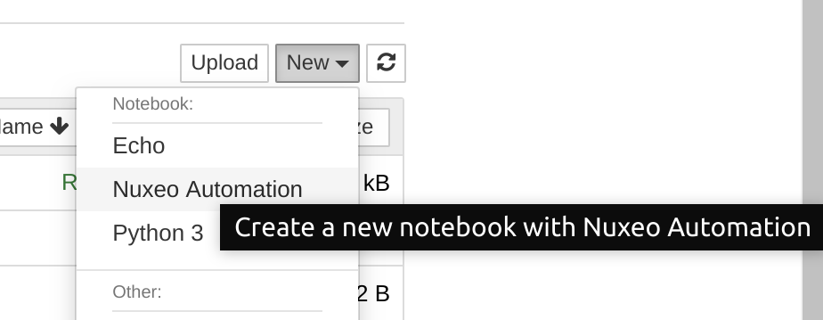
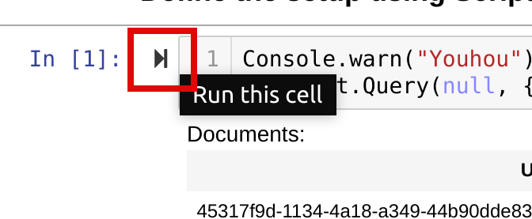
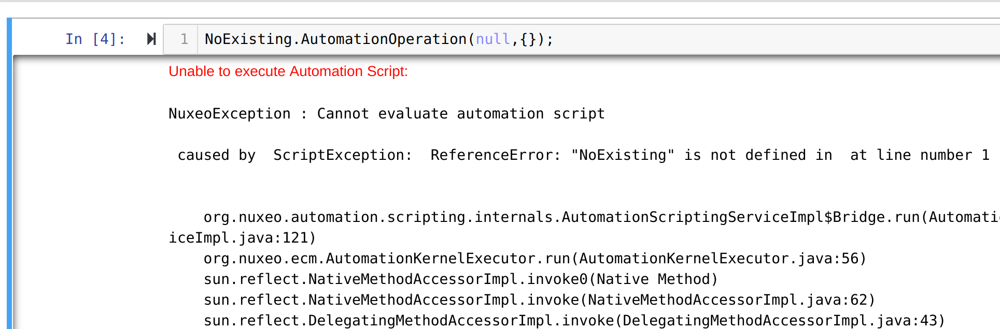
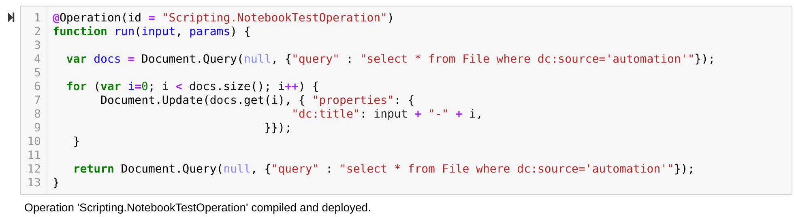
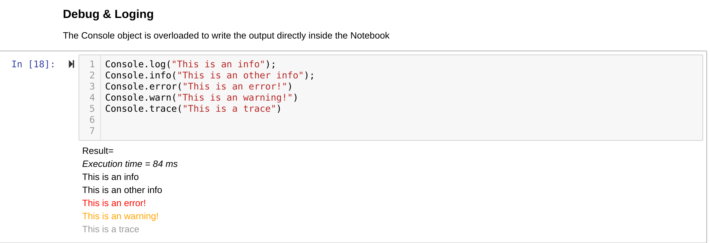

### About

The goal of this repository is to build a POC of what a Jupyther Notebook for Automation could be.

### Why

Jupyter Notebook are a nice way to test and build a ML Pipeline:

 - prepare the data
 - build the model
 - test the model

In a sense the goal is to try a similar approach with an Automation Scripting:

 - prepare the data that is needed in the repository so that the Operation can run
 - code the operation using scripting
 - test the operation

### POC Architecture:

The current POC uses a [wrapper around the default python Kernel](https://jupyter-client.readthedocs.io/en/stable/wrapperkernels.html) rather than building a complete custom kernel.
The idea is that the kernel just acts as a proxy to the Nuxeo Server.

The Nuxeo Server is exposing a custom operation that takes care of:

 - compile and execute the code
 - register the operation is neeed
 - return an HTML rendered result

In order to leverage Notebook interface, all Nuxeo output are for now done using HTML that is server side rendered by Nuxeo using freemarker.

    NoteBook ==> ZeroMQ ==> nuxeokernel ==> nuxeo python client ==> AutomationKernelExecutor

### Sample

See [this sample](samples/TestingAutomation.ipynb).

### Using the Automation Notebook

#### Nuxeo Kernel

`nuxeokernel` is the Jupyter Notebook *"server-side"* extension that allows the notebook server to communicate with Nuxeo.

When starting a new notebook, you should select the Nuxeo Kernel.

#### Interactive execution

When you start a Code cell you can use JS/AutomationScripting: just hit the Arrow on the left side to run the code.

NB: the `[number]` next to the arrow is the exxecution sequence number.

When the code is run, the result is displayed in the page:

 - the outcome of the script
 	- `document` and `documents` are displayed using html table
 - the execution time

In case of error, the full stack trace should be available:

#### Context

The Automation Script code is executed and thrown away by the Nuxeo server:

 - it is not persisted
 - there is no persistent context 
 	- the variables defined inside a cell will not be accessible within an other cell

However, since the repository is persistent on the Nuxeo side, all "side effect" of your code will be persistent.

Basically, if your script create a document and sets a variable:
 - the variable will not survive the execution
 - the document will remain inside the repository

#### Testing an Automation Scripting Operation

**Deploy**

If your script start with `@Operation(id = "<NameOfMyOperation>")` then the Nuxeo server will:

 - compile the code
 - create a new Operation 
 - send a confirmation that the code was compiled and deployed as an operation

Since the operation is kept by the Nuxeo server inside an extension point registry:

 - the operation can be called from any cell, any notebook, or the REST API
 - the operation will be "lost" is the server is restarted

You can update the code of the operation and each execution from the Notebook will:

 - unregister previous code
 - register the new operation
 - flush the Automation Compile cache 
 	- (not sure what the behavior under concurrency will be)

**Setup**

Most of the time, your operation can not work without a context to be established: users, documents, vocabularies ...

For that you can use a script cell that will be responsible for doing the setup: since the side effect on the Nuxeo server are persisted you can use the scripting to do the setup.

**Logs**

There is currently no breakpoint feature, but the `Console` object is overriden to be plugged inside the Notebook interface.

**Tests**

The idea is to use additional code cells to contain the test cases for your operation.

For now there is no specific Test feature: this may come in the future.

### Open questions

 - Implement the `ContentsManager` interface on Nuxeo?
    - see [pgcontents](https://github.com/quantopian/pgcontents) 
 - State Management: keep transient context between calls
 - Leverage existing client side extensions
 	- https://jupyter-contrib-nbextensions.readthedocs.io/en/latest/
    - https://github.com/Jupyter-contrib/jupyter_nbextensions_configurator

### Ref

 - https://ipython-books.github.io/16-creating-a-simple-kernel-for-jupyter/
 - https://jupyter.brynmawr.edu/services/public/dblank/Experiments/Java9/javakernel/
 - https://github.com/HelgeCPH/cypher_kernel/blob/c6c3dacf3dfaceec48abf8049e3d53d6d29077ae/cypher_kernel/kernel.py#L19

